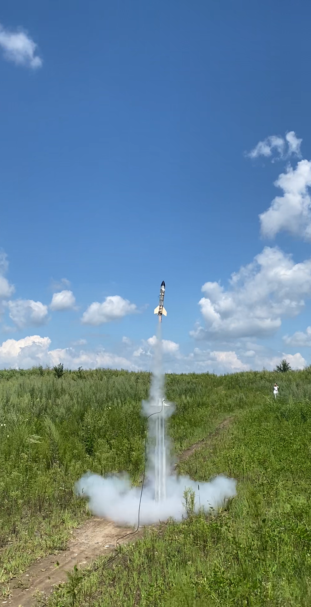

# 欢迎来到火箭组共享空间

这里是一个共享空间，用于火箭组资料与经验的传递。希望可以在曾迷失过的所有路口放上路标，在每一次外场后可以凯旋归来

## 最新消息：下一次活动

- 不迟于五月一日出第一次集体外场，为此我们需要：
    - 总体：完成飞机与火箭的第一版设计，并进行飞手训练
    - 电控：完成第一版电控板设计，在保证其稳定性的同时生产出足够的板子

## 精彩瞬间

## 共享空间投稿

- 无论你是初入坑的萌新，还是在航模之路上深耕已久的老玩家，都可以对共享空间中的内容进行投稿或提出建议，我们希望听到所有人的声音！
- 我们将在这里分享的知识包括但不限于
    - 新手入坑指南
    - 火箭制作规范
    - 安全手册
    - 团队合作建议
    - 一些灵感与其他的话
- 对于大段文字的投稿，请尽量使用markdown语法进行书写与排版，这对于让更多人读懂你的想法真的很重要！
- 投稿请联系网站维护人员

## 网站维护

**长期招聘网站协同维护人员**

网站维护需要的技能：
> 有良好的程序写作习惯，使用标准代码写法且尽可能多加注释
>
> 了解开源项目协作流程，会使用git、github等协作管理工具
> 
> 善于使用vscode、mkdocs、markdown等前端与代码工具

或者

> **热爱这件事**
>
> 技术的陌生不是难题，我们可以一起学习

有意者请联系 QQ：2716583569

{ loading=lazy }  
/// caption
主楼之春
///