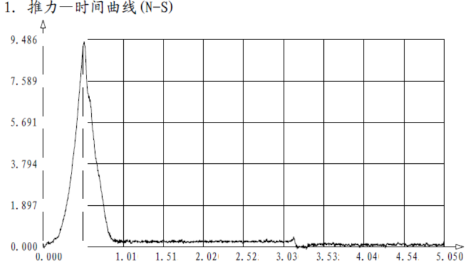
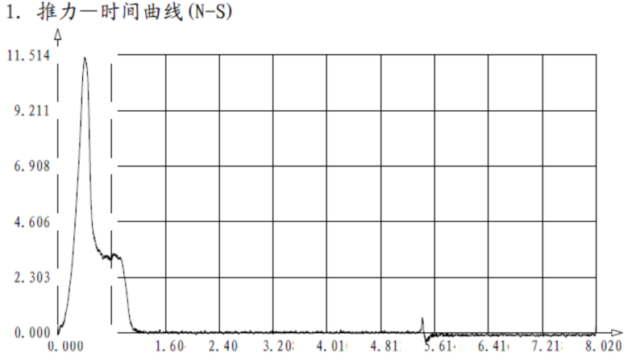
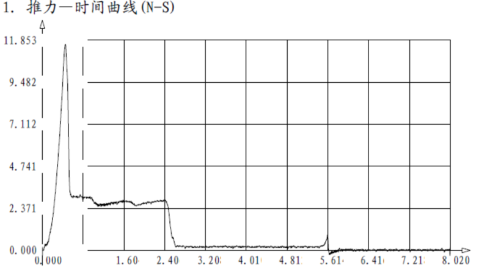
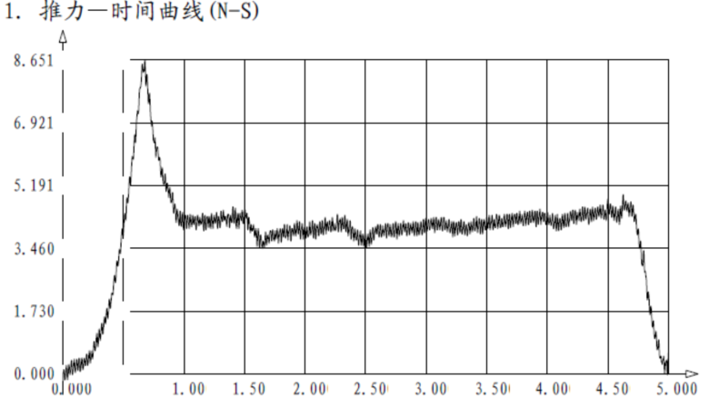
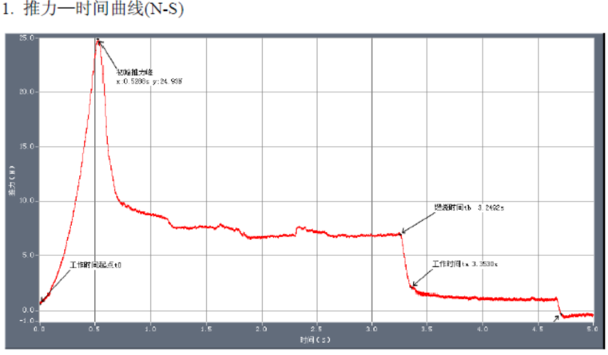
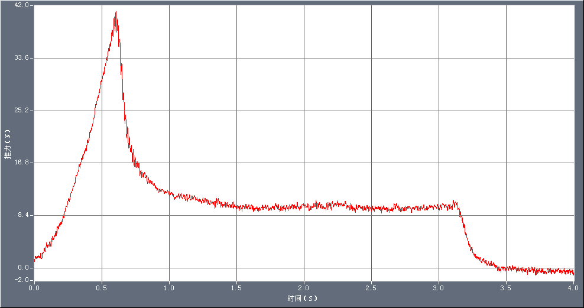
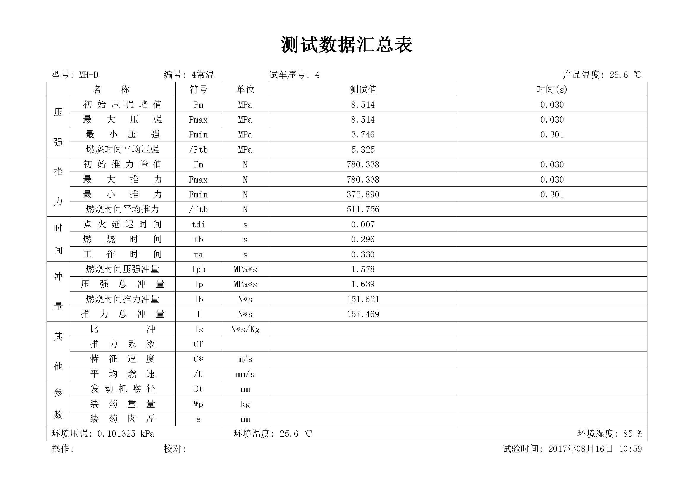
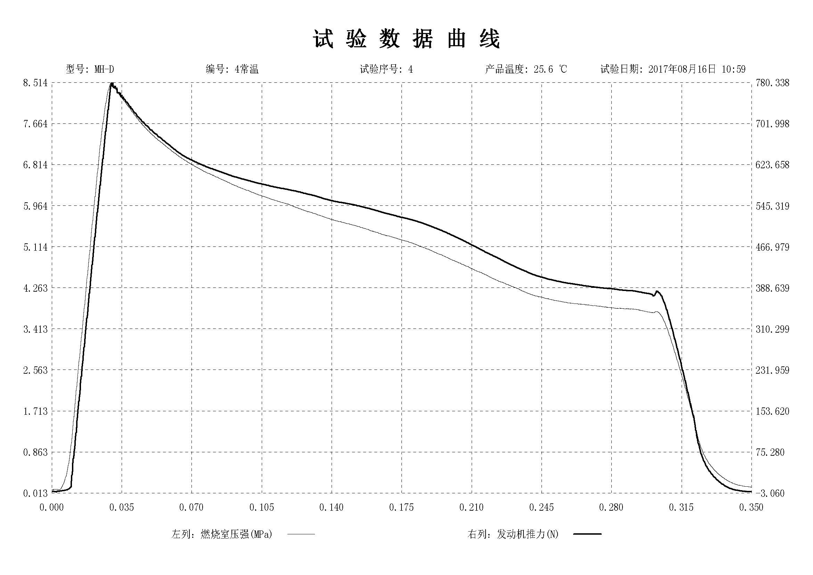

## A型发动机

| 规格/型号   | A型    | 外形尺寸（mm） | Φ18×70 |
| ------- | ----- | -------- | ------ |
| 初始质量（g） | 15.56 | 最大推力（N）  | 9.486  |
| 平均推力（N） | 3.349 | 总冲（N•S）  | 2.681  |
| 工作时间(s) | 0.801 | 延时时间(s)  | 2.284  |

 

## B型发动机

| 规格/型号   | B型    | 外形尺寸（mm） | Φ18×70 |
| ------- | ----- | -------- | ------ |
| 初始质量（g） | 18.66 | 最大推力（N）  | 11.514 |
| 平均推力（N） | 3.982 | 总冲（N•S）  | 4.185  |
| 工作时间(s) | 1.051 | 延时时间(s)  | 4.347  |

## C型发动机

| 规格/型号   | C型    | 外形尺寸（mm） | Φ18×70 |
| ------- | ----- | -------- | ------ |
| 初始质量（g） | 25.16 | 最大推力（N）  | 11.853 |
| 平均推力（N） | 3.095 | 总冲（N•S）  | 7.900  |
| 工作时间(s) | 2.552 | 延时时间(s)  | 3.014  |

## D5型发动机

| 规格/型号                                                                | D5型   | 外形尺寸（mm） | Φ20×95 |
| -------------------------------------------------------------------- | ----- | -------- | ------ |
| 初始质量（g）                                                              | 40.02 | 最大推力（N）  | 8.651  |
| 平均推力（N）                                                              | 3.938 | 总冲（N•S）  | 19.366 |
| 工作时间(s)                                                              | 4.918 | 延时时间(s)  | 0.034  |
| 空壳质量（g）                                                              | 9.05  |          |        |

## D8型发动机

| 规格/型号                                                                | D8型   | 外形尺寸（mm） | Φ24×70 |
| -------------------------------------------------------------------- | ----- | -------- | ------ |
| 初始质量（g）                                                              | 47.40 | 最大推力（N）  | 24.930 |
| 平均推力（N）                                                              | 8.068 | 总冲（N•S）  | 27.053 |
| 工作时间(s)                                                              | 3.353 | 延时时间(s)  | 1.355  |
| 空壳质量（g）                                                              | 11.34 |          |        |

## E12型发动机

| 产品型号      |         | E12-0            |         | 试验日期  |       | 09-01-2017 |         |
| --------- | ------- | ---------------- | ------- | ----- | ----- | ---------- | ------- |
| 产品编号      |         | 20170901-003     |         | 尺寸    |       | Φ28×100    |         |
| **试验数据：** |         |                  |         |       |       |            |         |
| 参数        | 符号      | 单位               | 数据      | 参数    | 符号    | 单位         | 数据      |
| 最大推力      | fmax    | N                | 41.0189 | 总冲    | I     | N*S        | 39.1715 |
| 对应时间      | tfmax   | S                | 0.6040  | 平均推力  | Fta   | N          | 11.4319 |
| 点火延迟      | tdi     | S                |         |       | Ftb   | N          | 17.3258 |
| 燃烧时间      | tb      | S                | 0.9210  | 延时时间  | td    | S          | 0.0050  |
| 工作时间      | ta      | S                | 3.4265  | 最大开伞力 | fkmax | N          |         |
| 燃速        | r       | mm/s             | 0.0000  | 比冲    | Is    | N*s/Kg     | +Inf    |
| **其他：**   |         |                  |         |       |       |            |         |
| 药量：48g    | 孔径4.1mm | 孔深：17.5-18mm  |         |       |       |            |         |

## MH-D型发动机

